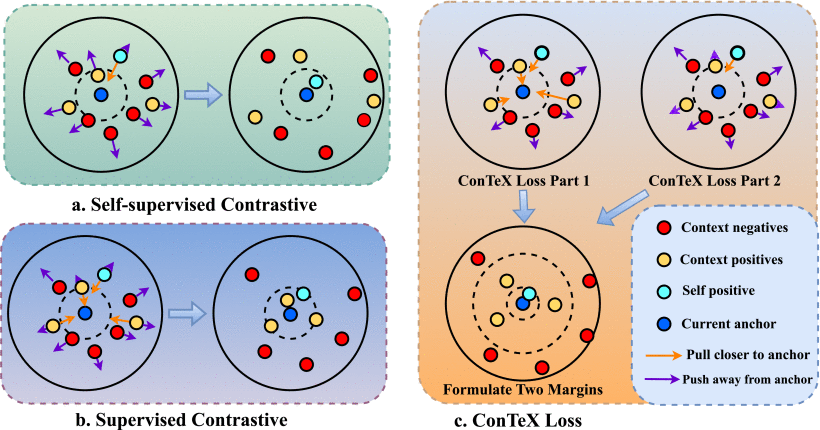

# ConTeX: Context‑Enriched Contrastive Loss

> **IEEE TMM, 2025**  
> [Paper link](https://ieeexplore.ieee.org/abstract/document/10814085)

<!-- Main Figure Placeholder -->


---

## Highlights

- **Two‑part loss** that balances label‑aware and self‑supervised signals.
- **Faster convergence** and **better fairness** than existing supervised contrastive losses.

---

## Train & Evaluation

### Pretraining stage (SupCon baseline)
```bash
python main_supcon.py \  
  --batch_size 1024 \  
  --loss_type 0 \  
  --learning_rate 0.5 \  
  --temp 0.1 \  
  --cosine
```

### ConTeX training stage (our method)
```bash
python main_contex.py \  
  --batch_size 1024 \  
  --loss_type 1 \  
  --learning_rate 0.5 \  
  --temp 0.1 \  
  --cosine
```

### Linear evaluation stage
```bash
python main_linear.py \  
  --batch_size 512 \  
  --learning_rate 5 \  
  --ckpt /path/to/model.pth
```

---

## Paper

If you use this code, please consider citing our paper:

> Haojin Deng and Yimin Yang, **"Context‑Enriched Contrastive Loss: Enhancing Presentation of Inherent Sample Connections in Contrastive Learning Framework,"** *IEEE Transactions on Multimedia*, vol. 27, pp. 429‑441, 2025.  
> DOI: 10.1109/TMM.2024.3521796

BibTeX:
```bibtex
@article{deng2025contex,
  author    = {Haojin Deng and Yimin Yang},
  title     = {Context-Enriched Contrastive Loss: Enhancing Presentation of Inherent Sample Connections in Contrastive Learning Framework},
  journal   = {IEEE Transactions on Multimedia},
  volume    = {27},
  pages     = {429--441},
  year      = {2025},
  doi       = {10.1109/TMM.2024.3521796}
}
```

---

## Acknowledgements

This implementation re‑uses large parts of the [SupContrast](https://github.com/HobbitLong/SupContrast) training pipeline — many thanks to the original authors.

---

## License

Distributed under the MIT License. See `LICENSE` for details.
